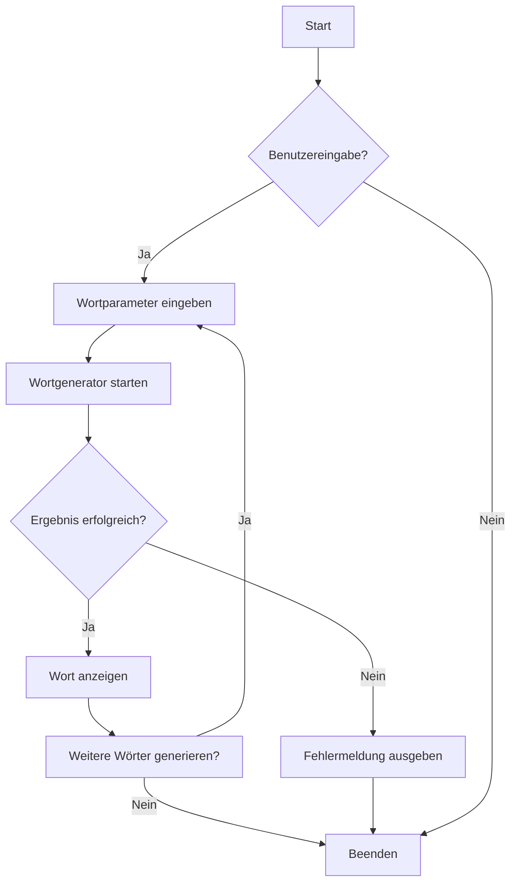

```mermaid
flowchart TD
    A[Start] --> B{Benutzereingabe?}
    B -- Ja --> C[Wortparameter eingeben]
    C --> D[Wortgenerator starten]
    D --> E{Ergebnis erfolgreich?}
    E -- Ja --> F[Wort anzeigen]
    E -- Nein --> G[Fehlermeldung ausgeben]
    F --> H[Weitere Wörter generieren?]
    H -- Ja --> C
    H -- Nein --> I[Beenden]
    G --> I
    B -- Nein --> I
```