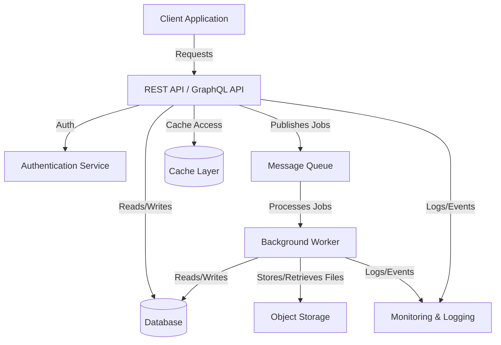

# Architecture Overview

Below is an architecture overview represented as a Mermaid diagram.

```mermaid
graph TD
  Client[Client Application]
  API[REST API / GraphQL API]
  Auth[Authentication Service]
  DB[(Database)]
  Cache[(Cache Layer)]
  Queue[Message Queue]
  Worker[Background Worker]
  Storage[Object Storage]
  Monitoring[Monitoring & Logging]

  Client -->|Requests| API
  API -->|Auth| Auth
  API -->|Reads/Writes| DB
  API -->|Cache Access| Cache
  API -->|Publishes Jobs| Queue
  Queue -->|Processes Jobs| Worker
  Worker -->|Reads/Writes| DB
  Worker -->|Stores/Retrieves Files| Storage
  API -->|Logs/Events| Monitoring
  Worker -->|Logs/Events| Monitoring
```